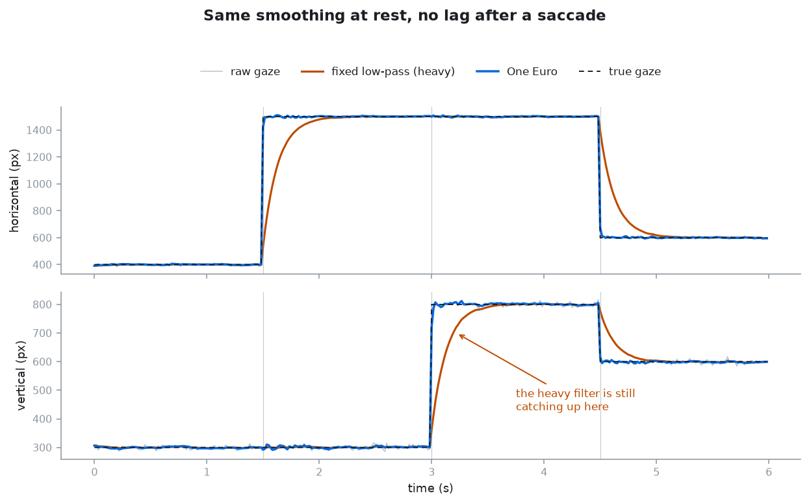
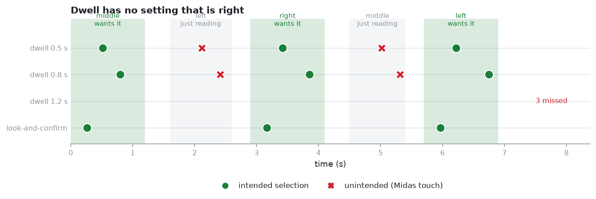
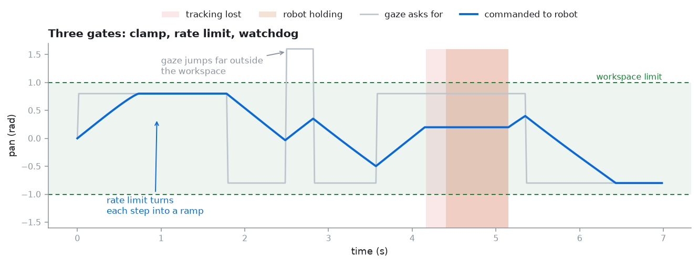
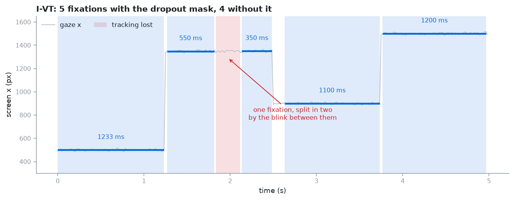

# Hands-free control of a robot-held camera with eye tracking

Look at where you want the camera pointed, and it points there. A webcam eye
tracker drives a robot-held camera through a per-user calibration, a
speed-adaptive filter and a safety layer that assumes the tracker will fail.

The interesting part is not the gaze estimation. It is everything downstream
of it, because **a gaze signal fails silently**: a blink gives you nothing, a
bad frame gives you a plausible-looking point in the wrong place, and a person
glancing at the door gives you a perfectly valid reading of somewhere they have
no intention of pointing a camera. None of those announce themselves. Most of
the design decisions here follow from taking that seriously.

**Status:** personal project, rebuilt and published 2026. Runs on Python 3.10+.
The algorithmic core has no dependency on a camera, a GUI toolkit or a physics
engine, which is why CI can test it on a machine with none of them attached.

---

## What is here

```
src/gazectl/
  geometry.py       screen geometry and the pixel-to-visual-angle conversion
  filters/          One Euro smoothing, I-VT fixation detection
  calibration/      per-user gaze-to-screen fit, accuracy and precision
  selection/        dwell and look-and-confirm techniques
  robot/            the safety layer between gaze and a moving camera
  study/            SUS and NASA-TLX scoring
  tracking/         MediaPipe adapter        (optional extra)
  ui/               PySide6 front end        (optional extra)
```

```bash
pip install -e ".[dev]"
pytest
```

112 tests, no hardware required.

---

## Three things this gets right that are easy to get wrong

### 1. Accuracy is reported in degrees, and cross-validated

Pixels are meaningless without the screen size and viewing distance, so every
error figure passes through a true subtended-angle calculation rather than the
small-angle approximation — which is already off by about 10% at 30 degrees
eccentricity.

More importantly, the calibration fit is scored by **holding out a whole
target**, not individual samples. Samples from the same target are nearly
identical, so a sample-wise split leaks the answer and reports an accuracy the
model does not have.

`python examples/01_calibration_accuracy.py`, on a synthetic eye:

```
Accuracy (degrees of visual angle)
  on calibration data    1.850 mean, 3.637 p95
  held-out target        2.050 mean, 4.024 p95
  overstatement          1.11x if the first number is quoted
```

Precision is reported two ways, because the two standard definitions are not
interchangeable — for uncorrelated noise they differ by about √2, so quoting
the smaller one against someone else's larger one makes a tracker look roughly
40% better than it is.

### 2. Smoothing adapts, because the requirement changes mid-signal

During a fixation you want heavy smoothing; jitter is all noise and it makes a
cursor unusable. During a saccade you want almost none; lag shows up directly
as the cursor trailing the eye. A fixed low-pass has to pick one and live with
it.



The blue trace sits on the true gaze through every saccade; the orange one is
still climbing half a second later. Measured, `python examples/02_filter_tradeoff.py`:

| filter | jitter (deg) | settling (samples) |
|---|---:|---:|
| unfiltered | 0.224 | 0.0 |
| fixed low-pass, light (α=0.6) | 0.145 | 3.5 |
| fixed low-pass, heavy (α=0.12) | 0.051 | 28.2 |
| **One Euro (fc=0.7, β=0.02)** | **0.074** | **1.0** |

The heavy filter buys its steadiness with settling time it pays on every
saccade. The One Euro filter gets close to it at rest while settling almost
immediately.

### 3. Dwell selection has no correct setting

Looking is not choosing — the eye is a perceptual organ, and a system that
treats a glance as a click fires selections the user never intended. This is
the Midas touch problem, and no dwell implementation escapes it.



Every red cross falls inside a span where the scripted user was *reading*, not
choosing. `python examples/03_technique_comparison.py` replays that one session
through both techniques:

| technique | fired | correct | unintended | missed |
|---|---:|---:|---:|---:|
| dwell 0.5 s | 5 | 3 | 2 | 0 |
| dwell 0.8 s | 5 | 3 | 2 | 0 |
| dwell 1.2 s | 0 | 0 | 0 | 3 |
| look-and-confirm | 3 | 3 | 0 | 0 |

Shorten the dwell and it fires on things the user was only reading; lengthen it
and it starts missing what they meant. Look-and-confirm has no unintended
selections here because looking genuinely is not selecting — and it pays for
that by needing a hand.

---

## The safety layer



Three independent gates between the tracker and the robot, each sufficient on
its own:

- **Workspace clamp** — applied last, so nothing downstream can undo it.
- **Rate limit** — a jump in the gaze signal becomes a ramp, not a lurch.
- **Watchdog** — no valid sample within the timeout and the robot holds.

It holds rather than returning to a home pose. A robot that sweeps back to
centre every time the user blinks is worse than one that stops, and the sweep
is itself unexpected motion.

One subtlety worth stating, because getting it wrong produces a lurch at the
worst moment: `dt` for the rate limiter is measured across **every** cycle,
valid or not. If it were only measured across valid cycles, a two-second
dropout followed by one good sample would authorise two seconds' worth of
travel in a single step — right after the system has finished not knowing where
the user was looking. There is a test for exactly this.

---

## Reproducing the numbers

```bash
python examples/01_calibration_accuracy.py
python examples/02_filter_tradeoff.py
python examples/03_technique_comparison.py
python examples/make_figures.py          # redraws docs/figures/
```

All of them are seeded, and the first three run in CI, which is what stops
the tables above drifting away from what the code does.

**These are simulations, not measurements of a real tracker.** The eye in
example 1 is synthetic and the user in example 3 is scripted. They demonstrate
that the machinery reports what it should; they are not evidence about human
performance. The questionnaire scoring in `gazectl.study` is there for the
study that answers that question, and the study protocol is a within-subject
comparison of the three techniques — gaze-following, look-and-confirm and a
mouse baseline — using SUS and NASA-TLX.

---

## What this does not do

- **The MediaPipe adapter is not covered by CI.** It needs a camera, so it is
  an optional extra and the test suite does not exercise it. Treat it as the
  least-tested module here.
- **The screen geometry assumes the eye sits on the normal through the screen
  centre.** A user sitting well off to one side breaks that assumption, and
  nothing detects it.
- **The head-pose interaction is learned, not modelled.** Head
  angles go into the polynomial fit as features. This works within the range
  covered by calibration and degrades outside it, with no warning.
- **No smooth-pursuit handling.** I-VT classifies pursuit as a long saccade,
  so tracking a moving object looks like noise to the fixation detector.

  

  What it does do correctly is refuse to merge across a tracking dropout: the
  fixation either side of the blink is reported as two, because where the eye
  went during the blink is unknown.
- **Dwell and look-and-confirm only.** The mouse baseline from the study
  protocol is not implemented here; it needs no gaze machinery.

---

## References

- Casiez, Roussel and Vogel (2012), *1€ Filter* — CHI
- Salvucci and Goldberg (2000), *Identifying fixations and saccades* — ETRA
- Jacob (1990), *What you look at is what you get* — CHI, on the Midas touch
- Brooke (1996), *SUS: a quick and dirty usability scale*
- Hart and Staveland (1988), *Development of NASA-TLX*
- Bangor, Kortum and Miller (2009), on SUS adjective ratings

---

## License

MIT — see [LICENSE](LICENSE).

Parth Deshmukh · Aalen University of Applied Sciences
